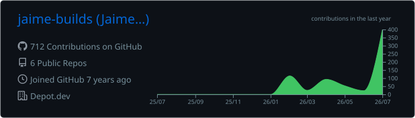
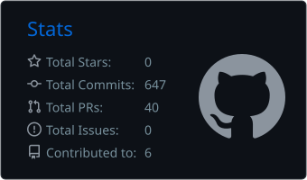

# 👋 Hi, I'm Jaime - I Build Things

Enterprise Support Engineer @ Depot.dev, building things in Python and Go when I'm not on the clock.

**Full portfolio, projects, and homelab:** [jaime.build](https://jaime.build)

## 📊 GitHub Stats

  
  

## 📫 Let's Connect

- **LinkedIn:** [linkedin.com/in/jaimedelapaz](https://linkedin.com/in/jaimedelapaz)
- **Portfolio:** [www.jaime.build](https://www.jaime.build)

---

## 🛠️ Tech Stack

**Cloud & Infrastructure**
AWS • Docker • Kubernetes • Terraform • Cloudflare • Linux

**Languages**
Python • Go • TypeScript • JavaScript • Bash • PowerShell • SQL

**Databases**
PostgreSQL • ClickHouse • SQLite • MySQL

**Monitoring & Observability**
Datadog • Prometheus • Grafana • OpenTelemetry

**DevOps & CI/CD**
GitHub Actions • Terraform • Terragrunt • Depot • Jenkins

**Web & Frameworks**
Flask • React • SQLAlchemy • Tailwind CSS • Vite

---
